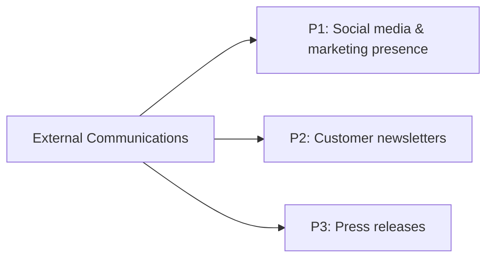

# DC5B Protocol

Systematic decision making for DC5B

## Comms routines

### Internal

```mermaid
graph LR;
    E[External Communications] --> F[P1: Social media & marketing presence];
    E --> G[P2: Customer newsletters];
    E --> H[P3: Press releases];
```

P1 = highst priority based on impact on reputation, money-flow and productivity.

### External comms

```mermaid
graph LR;
    E[External Communications] --> F[P1: Social media & marketing presence];
    E --> G[P2: Customer newsletters];
    E --> H[P3: Press releases];
```
