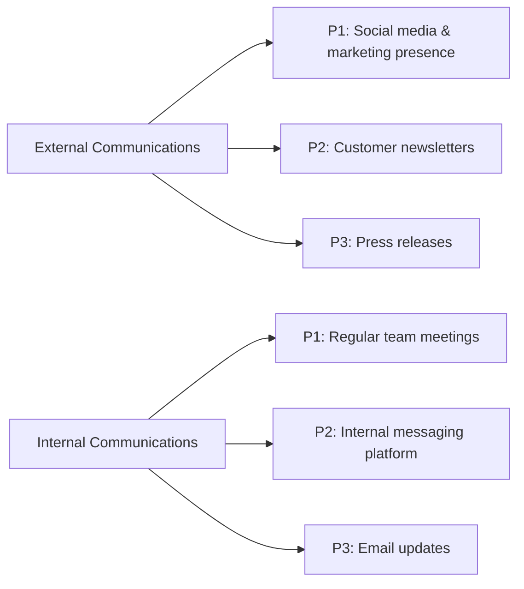

# DC5B Protocol

Systematic decision making for DC5B

## Comms routines

> I picture a flow diagram, state machines, a system with queues, triggers and tasks that makes sending comms almost habitual.
>
> We need to do this and need to do it well so I think a designed system that we can evaluate, reason about and refine is the way to go.
>
> Don't get me wrong, the content must be heartfelt and real, but the routine is automatic. Feels like one of those examples where defining your own boundaries benefits your creativity within.

_[@LL782](https://github.com/LL782) Sept 2023_

### DC5B comms in context

For Communication Channels in a broader context checkout [Miro > DC5B > Comms](https://miro.com/app/board/uXjVO3dkXBo=/?moveToWidget=3458764560836836090&cot=14)

### Working draft

P1 = highest priority based on impact on reputation, money-flow and productivity. _Maybe somekind of happiness index too?_
